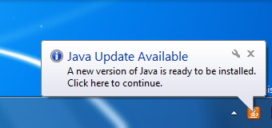
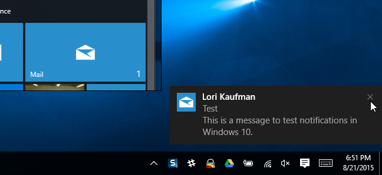

# Testing tools

Here are some tools to aid in testing certain features.

---

## Windows Notifications
Download the executable version's of these tools and use them in command prompt to test notification blocking.

### Balloons tooltips on Windows 7


**Download:** https://www.paralint.com/projects/notifu/#Download

In Command Prompt, run the following to generate a tooltip:

```cmd
"notifu.exe" /m "This is a simple Notifu message."
```

### Toast notifications on Windows 8+


**Download:** https://github.com/nels-o/toaster

In Command Prompt, run the following to generate a toast UI:

```cmd
"toaster.exe" -t "Notification title" -m "Body text"
```
